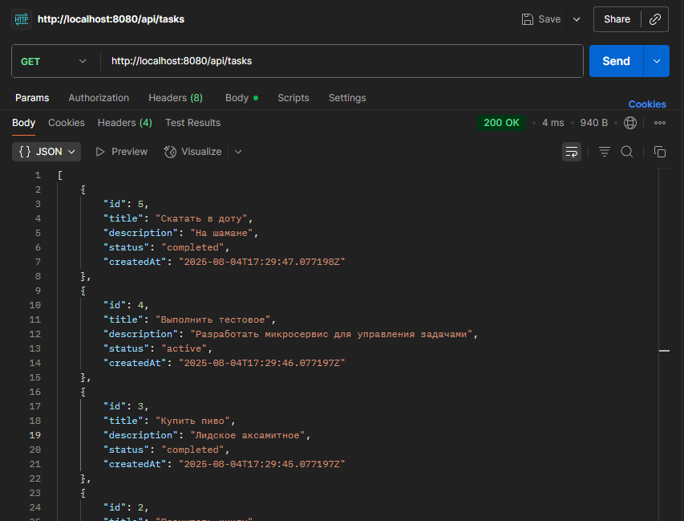
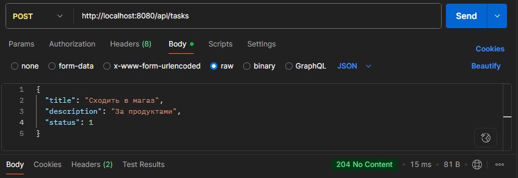
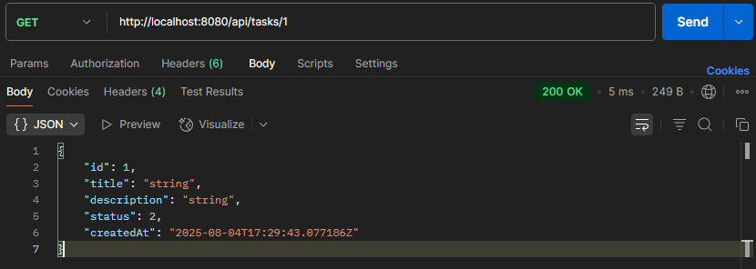
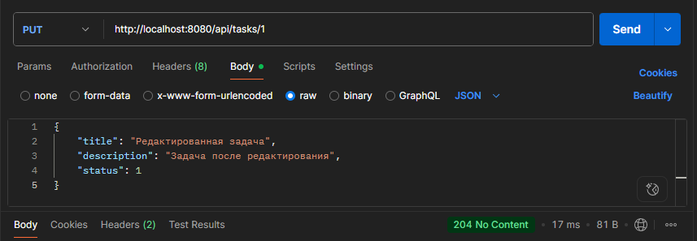
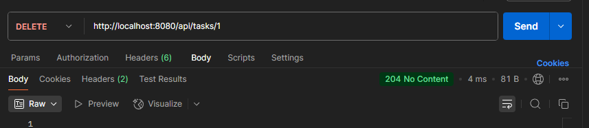

# Тестовое задание в компанию Интас

## Запуск
1. Клонировать репозиторий:
```
git clone https://github.com/GreyCardinal59/TodoService.git
cd TodoService\src\TodoApi
```

2. Запустить с помощью Docker Compose:
```
docker-compose up -d
```

3. API доступно по http://localhost:8080

Swagger: http://localhost:8080/swagger/index.html

При запуске
- Создается база данных PostgreSQL
- Применяются миграции и сидирование
- Запуск бэка

## Базовый функционал (CRUD-операции)
```
GET /api/tasks
```


```
POST /api/tasks
```


```
GET /api/tasks/1
```


```
PUT /api/tasks/1
```


```
DELETE /api/tasks/1
```


## Выполненные дополнительные задания

### Вариант А: Redis

- закешировал ответы GET


- инвалидация кеша при изменении данных


### Вариант В: RabbitMQ
- Отправка события в RabbitMQ при изменении статуса задачи


### Вариант С: gRPC-сервис
- gRPC-сервис для статистики:
Клиент создан внутри приложения, в качестве примера создал метод контроллера, чтобы получить ответ клиента


## Описание

Старался придерживаться чистой архитектуры, принципам SOLID, но раскидать по слоям (проектам) времени не хватило. 
